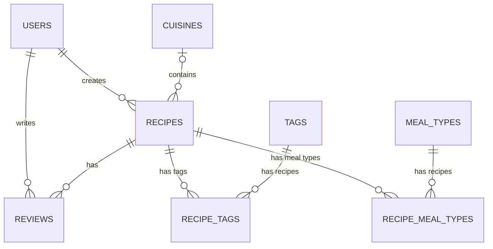

# Recipes Domain Schema

Этот документ описывает схему БД, связи и порядок создания таблиц.

Это рабочая целевая схема, а не текущая реализация. В проекте уже есть только часть таблиц и связей, а остальные сущности ниже описаны как следующий этап расширения. Нерешённые части явно помечаются и не считаются утверждённым контрактом до отдельного шага.

## Область схемы

Схема описывает расширенную модель `Recipes API`:

- `users`
- `recipes`
- `reviews`
- `cuisines`
- `tags`
- `meal_types`
- `recipe_tags`
- `recipe_meal_types`

## Связи

## Таблицы

### `users`

- `id` BIGINT UNSIGNED, PK, AUTO_INCREMENT
- `fullname` VARCHAR(255), NOT NULL
- `email` VARCHAR(255), NOT NULL, UNIQUE
- `password_hash` VARCHAR(255), NOT NULL
- `created_at` DATETIME, NOT NULL
- `updated_at` DATETIME, NOT NULL

Примечание: в Sequelize-модели колонке `password_hash` соответствует поле `passwordHash`; открытый `password` используется только как вход регистрации и логина.

### `recipes`

- `id` BIGINT UNSIGNED, PK, AUTO_INCREMENT
- `user_id` BIGINT UNSIGNED, NOT NULL, FK, INDEX, `users.id`, `CASCADE`
- `cuisine_id` INT UNSIGNED, NULL, FK, INDEX, `cuisines.id`, `SET NULL`
- `title` VARCHAR(200), NOT NULL
- `ingredients` TEXT, NOT NULL
- `instructions` TEXT, NOT NULL
- `slug` VARCHAR(220), NOT NULL, UNIQUE
- `image_url` VARCHAR(500), NULL
- `prep_time_min` SMALLINT UNSIGNED, NULL
- `cook_time_min` SMALLINT UNSIGNED, NULL
- `servings` SMALLINT UNSIGNED, NULL
- `difficulty` ENUM(`easy`, `medium`, `hard`), NOT NULL, default `easy`
- `calories_per_serving` SMALLINT UNSIGNED, NULL
- `rating_avg` DECIMAL(3,2), NOT NULL, default `0.00`
- `review_count` INT UNSIGNED, NOT NULL, default `0`
- `created_at` DATETIME, NOT NULL
- `updated_at` DATETIME, NOT NULL
- `deleted_at` DATETIME, NULL

Примечания:

- `rating_avg` и `review_count` пересчитываются при изменении отзывов, если решение об их денормализации будет принято.

### `reviews`

- `id` BIGINT UNSIGNED, PK, AUTO_INCREMENT
- `recipe_id` BIGINT UNSIGNED, NOT NULL, FK, UNIQUE вместе с `user_id`, `recipes.id`, `CASCADE`
- `user_id` BIGINT UNSIGNED, NOT NULL, FK, UNIQUE вместе с `recipe_id`, `users.id`, `CASCADE`
- `rating` TINYINT UNSIGNED, NOT NULL, 1..5
- `body` TEXT, NULL
- `created_at` DATETIME, NOT NULL
- `updated_at` DATETIME, NOT NULL

Примечание: один пользователь может оставить один отзыв на один рецепт.

### `cuisines`

- `id` INT UNSIGNED, PK, AUTO_INCREMENT
- `title` VARCHAR(100), NOT NULL, UNIQUE
- `created_at` DATETIME, NOT NULL
- `updated_at` DATETIME, NOT NULL

### `tags`

Таблица и Sequelize-связь с recipes через `recipe_tags` добавлены в текущем backend. `GET /api/v1/tags` возвращает справочник, а `POST /api/v1/recipes` принимает строки tags, создаёт отсутствующие tags и сохраняет связи; обновление tags через PATCH уже подключено.

- `id` INT UNSIGNED, PK, AUTO_INCREMENT
- `title` VARCHAR(100), NOT NULL, UNIQUE
- `slug` VARCHAR(120), NOT NULL, UNIQUE
- `created_at` DATETIME, NOT NULL
- `updated_at` DATETIME, NOT NULL

### `meal_types`

Модель `MealType`, базовая таблица `meal_types`, seed-данные справочника, публичный `GET /api/v1/meal-types`, чтение и запись meal types в Recipes API добавлены. Recipes API принимает существующие идентификаторы через `mealTypeIds`; новые значения справочника из пользовательского запроса не создаются.

- `id` INT UNSIGNED, PK, AUTO_INCREMENT
- `title` VARCHAR(100), NOT NULL, UNIQUE
- `created_at` DATETIME, NOT NULL
- `updated_at` DATETIME, NOT NULL

### `recipe_tags`

Таблица и Sequelize-связи добавлены в текущем backend; создание связей выполняется при `POST /api/v1/recipes`, а синхронизация tags при PATCH — через `setTags`.

- `recipe_id` BIGINT UNSIGNED, PK, FK, `recipes.id`, `CASCADE`
- `tag_id` INT UNSIGNED, PK, FK, INDEX, `tags.id`, `CASCADE`

Примечание: составной PK `(recipe_id, tag_id)`, без собственного `id` и без timestamps.

### `recipe_meal_types`

Промежуточная таблица `recipe_meal_types`, Sequelize-связи `Recipe` ↔ `MealType`, seed-связи для recipes 1–5 и чтение meal types в ответах Recipes API добавлены.

- `recipe_id` BIGINT UNSIGNED, PK, FK, `recipes.id`, `CASCADE`
- `meal_type_id` INT UNSIGNED, PK, FK, INDEX, `meal_types.id`, `CASCADE`

Примечание: составной PK `(recipe_id, meal_type_id)`, без собственного `id` и без timestamps.

## Внешние ключи

- `recipes.user_id` → `users.id`, `CASCADE` / `CASCADE`
- `recipes.cuisine_id` → `cuisines.id`, `SET NULL` / `CASCADE`
- `reviews.recipe_id` → `recipes.id`, `CASCADE` / `CASCADE`
- `reviews.user_id` → `users.id`, `CASCADE` / `CASCADE`
- `recipe_tags.recipe_id` → `recipes.id`, `CASCADE` / `CASCADE`
- `recipe_tags.tag_id` → `tags.id`, `CASCADE` / `CASCADE`
- `recipe_meal_types.recipe_id` → `recipes.id`, `CASCADE` / `CASCADE`
- `recipe_meal_types.meal_type_id` → `meal_types.id`, `CASCADE` / `CASCADE`

## Индексы

- `users.email` — `UNIQUE`
- `cuisines.title`, `meal_types.title` — `UNIQUE`
- `tags.title`, `tags.slug` — `UNIQUE`
- `recipes.slug` — `UNIQUE`
- `recipes.user_id` — `INDEX`
- `recipes.cuisine_id` — `INDEX`
- `reviews.recipe_id, user_id` — `UNIQUE`
- `recipe_tags.recipe_id, tag_id` — `PRIMARY KEY`
- `recipe_meal_types.recipe_id, meal_type_id` — `PRIMARY KEY`

## Порядок создания таблиц

1. `users`
2. `cuisines`
3. `tags`
4. `meal_types`
5. `recipes`
6. `recipe_tags`
7. `recipe_meal_types`
8. `reviews`

Откат делается в обратном порядке.

## Типы Sequelize

- `BIGINT UNSIGNED` → `DataTypes.BIGINT.UNSIGNED`
- `INT UNSIGNED` → `DataTypes.INTEGER.UNSIGNED`
- `SMALLINT UNSIGNED` → `DataTypes.SMALLINT.UNSIGNED`
- `TINYINT UNSIGNED` → `DataTypes.TINYINT.UNSIGNED`
- `VARCHAR(n)` → `DataTypes.STRING(n)`
- `TEXT` → `DataTypes.TEXT`
- `DECIMAL(p, s)` → `DataTypes.DECIMAL(p, s)`
- `ENUM(...)` → `DataTypes.ENUM(...)`
- `DATETIME` → `DataTypes.DATE`

`underscored: true` переводит имена полей в snake_case в БД.
